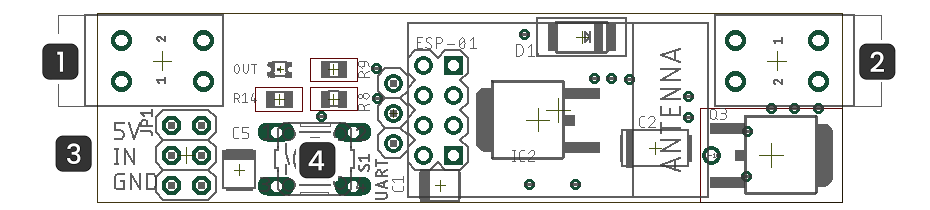

ifndef::lang[:lang: pl]

ifeval::["{lang}" == "pl"]
== Opis techniczny

=== Informacje ogólne

[cols="<1,>2s", grid="none"]
|===
| Zasilanie | 12V/24V DC
| Maksymalne obciążenie | 3A
2+| Moduł WiFi ESP8266 pracujący w standardzie 802.11 b/g/n na częstotliwości 2.4Ghz
| Porty używane do komunikacji:| TCP 2015
2+| Domyślna konfiguracja interfejsu sieciowego poprzez DHCP
|===

=== Opis zacisków

[{device} - widok ogólny]

. Zasilanie:
+
[cols="1,4s",width=50%]
|===
| 2 | 12V/24V DC
| 1 | GND
|===

. Wyjście LED:
+
[cols="1,4s",width=50%]
|===
| 1 | LED+
| 2 | GND
|===

. Czujniki:
+
[cols="1,1,3s",width=50%]
|===
| 1 | 1 | +5V
| 2 | 2 | IN1/IN2
| 3 | 3 | GND
|===

. Przycisk konfiguracyjny:
+
[options="header",cols="1,3s",width=50%]
|===
| zdarzenie | efekt
| click x1  | jasność +25%
| hold > 3s | tryb konfiguracji
|===

endif::[]

<<<
