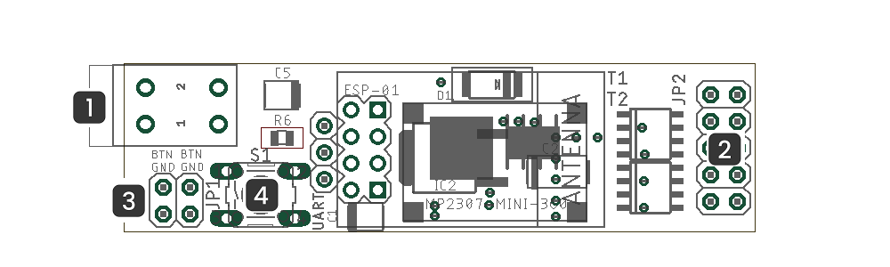

ifndef::lang[:lang: pl]

ifeval::["{lang}" == "pl"]
== Opis techniczny

=== Informacje ogólne

[cols="<1,>2s"]
|===
| Zasilanie             | 12V/24V DC
| Maksymalne obciążenie | 4x1A
| Wymiary               | 60mm x 16mm x 10mm
| Moduł WiFi ESP8266    | standard 802.11 b/g/n 2.4Ghz
| Domyślna konfiguracja adresu sieciowego | DHCP
| Porty używane do komunikacji | TCP:2015
|===

=== Opis zacisków

[{device} - widok ogólny]

. Zasilanie:
+
[cols="1,4s",width=50%]
|===
| 2 | 12V/24V DC
| 1 | GND
|===

. Wyjście LED:
+
[cols="1,1,4s",width=50%]
|===
| + | + | LED Plus
| G | + | LED G / LED1
| B | + | LED B / LED2
| R | + | LED R / LED3
| W | + | LED W / LED4
|===
+
NOTE: Tryb pracy: (RGBW/4xLED) oraz kolejność sygnałów RGBW można dostosować do używanej taśmy LED w ustawieniach sterownika

. Wejścia przycisków:
+
[cols="1,1,3s",width=50%]
|===
| 1 | 1 | BTN
| 2 | 2 | GND
|===

. Przycisk konfiguracyjny:
+
[options="header",cols="1,3s",width=50%]
|===
| zdarzenie | efekt
| click x1  | jasność +25%
| hold > 3s | tryb konfiguracji
|===
+
NOTE: Domyślny kolor ustawiany przy ręcznym załączeniu można dostosować w ustawieniach sterownika

<<<
endif::[]

ifeval::["{lang}" == "en"]
== Technical Description

=== General Information

[cols="<1,>2s"]
|===
| Power Supply           | 12V/24V DC
| Maximum Load           | 4x1A
| Dimensions             | 60mm x 16mm x 10mm
| WiFi Module ESP8266    | 802.11 b/g/n standard 2.4GHz
| Default Network Address Configuration | DHCP
| Ports used for communication | TCP:2015
|===

=== Terminal Description

[{device} - General View]

. Power Supply:
+
[cols="1,4s",width=50%]
|===
| 2 | 12V/24V DC
| 1 | GND
|===

. LED Output:
+
[cols="1,1,4s",width=50%]
|===
| + | + | LED Plus
| G | + | LED G / LED1
| B | + | LED B / LED2
| R | + | LED R / LED3
| W | + | LED W / LED4
|===
+
NOTE: The operating mode (RGBW/4xLED) and the RGBW signals order can be adjusted to match the LED strip being used in the driver settings.  

. Button Inputs:
+
[cols="1,1,3s",width=50%]
|===
| 1 | 1 | BTN
| 2 | 2 | GND
|===

. Configuration Button:
+
[options="header",cols="1,3s",width=50%]
|===
| Event | Effect
| click x1  | Brightness +25%
| hold > 3s | Configuration mode
|===

NOTE: Default color in manual switching can be adjusted in the driver settings.  

<<<
endif::[]
